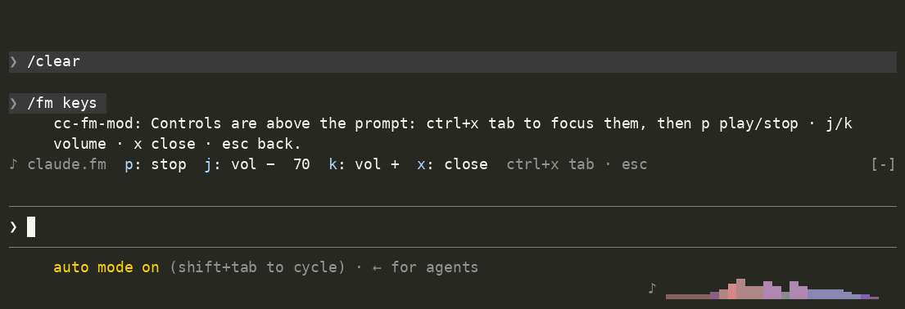

# cc-fm

claude.fm in your Claude Code prompt. Audio plays on your machine, and a live spectrum runs in the hint row under the composer, whether Claude Code runs locally or on a server you SSH into.



An unofficial community project. Not affiliated with or endorsed by Anthropic.

## How it works

cc-fm has two parts:

- **`cc-fm`**, a small Go player that runs on the machine with your speakers. A single ffmpeg process plays the stream and feeds an FFT, and the player serves the resulting bars over an owner-only unix socket.
- **The mod**, a Claude Code plugin that reads the bars from that socket, draws them under the prompt and adds `/fm` commands.

```
 your machine (speakers)                   any machine running Claude Code
┌──────────────────────────┐   ssh -R     ┌────────────────────────────┐
│ cc-fm serve              │◀════════════▶│ ~/.cc-fm/fm.sock           │
│  yt-dlp → ffmpeg ─┬─▶ 🔊 │  commands ▶  │  session A   ♪ ▁▃▇▅▂       │
│                   └─▶ FFT│  ◀ bars      │  session B   ♪ ▁▃▇▅▂       │
└──────────────────────────┘              └────────────────────────────┘
```

Audio never crosses the network. Only the bar heights do, at under 1 KB/s. Every session, local or remote, connects to the same single player, so running several Claude sessions just works. The wire format is documented in [PROTOCOL.md](PROTOCOL.md).

## Requirements

- Claude Code 2.1.287 or later, the first release with mods
- On the machine with speakers: macOS or Linux, plus `ffmpeg` and `yt-dlp` (Homebrew installs them for you)
- On the machine running Claude Code: `curl`, which macOS and Linux already have

## Setup

### 1. Install the player on your machine

Pick one:

```sh
# Homebrew (macOS, Linux): pulls in ffmpeg and yt-dlp too
brew install code-akram/tap/cc-fm

# Install script: a prebuilt binary to ~/.local/bin, checksum-verified
curl -fsSL https://raw.githubusercontent.com/code-akram/cc-fm-mod/main/install.sh | sh

# From source
go install github.com/code-akram/cc-fm-mod/cmd/cc-fm@latest
```

Homebrew 6 and later only load formulae from third-party taps that you trust. Installing by full name, as above, trusts this one formula. If Homebrew says it's ignoring formulae from `code-akram/tap`, for example after `brew tap code-akram/tap` and a plain `brew install cc-fm`, run `brew trust --formula code-akram/tap/cc-fm` and install again.

With the install script or `go install`, also install `ffmpeg` and `yt-dlp` (`brew install ffmpeg yt-dlp`, or your package manager). To read the script before running it: `curl -fsSL https://raw.githubusercontent.com/code-akram/cc-fm-mod/main/install.sh | less`.

Then:

```sh
cc-fm doctor                        # checks ffmpeg, yt-dlp and the audio device
cc-fm serve --autoplay default      # starts claude.fm
```

With Homebrew, `brew services start cc-fm` keeps the player running at login instead. It stays silent until you start it with `/fm`.

### 2. Install the mod in Claude Code

```
/plugin marketplace add code-akram/cc-fm-mod
/plugin install cc-fm-mod@cc-fm
```

`♪` and the bars appear at the right of the hint row while something is playing. To hack on the mod instead, clone the repo and run `claude --plugin-dir ./cc-fm-mod/mod`.

### 3. Optional: Claude Code on a remote machine

Forward the player's socket over SSH. A dedicated host alias works best, so your everyday logins don't compete for the socket:

```
# ~/.ssh/config on your machine
Host myserver-fm
  HostName myserver.example.com
  User you
  RemoteForward /home/you/.cc-fm/fm.sock /Users/you/.cc-fm/fm.sock
```

```sh
ssh -f -N -o ExitOnForwardFailure=yes myserver-fm    # a background tunnel
```

Every Claude session on that server then shows the bars. Two things need to be true on the server:

- `~/.cc-fm` exists.
- sshd allows remote socket forwarding. That's the default, but some configs restrict it. To work, `AllowStreamLocalForwarding` must be `yes`, `all` or `remote`. Add `StreamLocalBindUnlink yes` too, so a reconnect can replace a stale socket.

Socket forwarding keeps the player reachable only by your account. Don't expose it over TCP on a shared machine: anyone who could reach the player could control it, and make it fetch any URL from your network.

## Usage

In Claude Code:

| Command | Does |
|---|---|
| `/fm` | toggle play and stop |
| `/fm stop` | stop |
| `/fm vol 40` or `/fm 40` | set the volume, 0–100 |
| `/fm status` | what's playing, the volume and how many sessions are listening |
| `/fm play <source>` | play something else |
| `/fm keys` | open the controls, ready for the keyboard: `p` play, `s` stop, `j`/`k` quieter and louder, `esc` to close. While they have the keyboard their rail lights up in coral; click away and they dim (`ctrl+x tab` takes them back). Each control is clickable too. |
| `/fm help` | what `/fm` takes |

All of them work mid-turn.

From any terminal:

```
cc-fm serve [flags]      run the player (one per machine)
cc-fm play [source]      start playing (default: https://clau.de/radio)
cc-fm stop               stop playing
cc-fm vol <0-100>        set the volume
cc-fm status             print the player's status as JSON
cc-fm watch              draw the bars in this terminal
cc-fm doctor             check ffmpeg, yt-dlp and the audio device
```

Useful `serve` flags:

- `--volume`: the starting volume. Without it, the player starts at the last volume you set (it remembers it in `~/.cc-fm/state.json`), or 70 the first time.
- `--output`: the audio device, `auto`, `audiotoolbox`, `pulse`, `alsa` or `null`.
- `--delay-ms`: holds the speakers back so remote bars line up with what you hear. Try roughly your ping time to the server.
- `--yt-dlp-args`: extra yt-dlp arguments, for example `"--cookies-from-browser firefox"`.

### Sources

| Source | Example |
|---|---|
| claude.fm, the default | `https://clau.de/radio` |
| Any YouTube video or stream | `https://www.youtube.com/watch?v=…` |
| A direct stream URL | `https://example.com/stream.mp3` |
| A built-in synthetic track, for testing offline | `demo` |

`/fm play` and `cc-fm play` accept only those. A request can come from a session on another machine, through the SSH forward, and a local path or ffmpeg graph would let it read, or with some filters write, files on the player's machine. To play a local file (looped) or an ffmpeg `lavfi:` graph, start the player with it: `cc-fm serve --autoplay /path/to/track.ogg`.

## Troubleshooting

- **No bars.** Run `cc-fm doctor` on the player's machine. The mod stays out of the hint row until a player answers, and it retries every 3 seconds. The socket defaults to `~/.cc-fm/fm.sock`; set `$CC_FM_SOCKET` to use another path.
- **`yt-dlp: Sign in to confirm you're not a bot`.** YouTube blocks many datacenter IPs. Run the player on your own machine, which is the intended setup anyway, or pass browser cookies with `--yt-dlp-args`.
- **`remote port forwarding failed`.** See the sshd notes under step 3, or remove a stale `~/.cc-fm/fm.sock` on the server.
- **Bars lag behind the sound over SSH.** Use `--delay-ms`.
- **Stutters, or crackles at track changes.** The player reads up to 15 seconds ahead of the speakers, so slow downloads from YouTube are absorbed. If the stream stalls for longer than that, playback pauses once to rebuffer rather than stuttering. Each pause is logged as `underrun: …` in the player's log (`/opt/homebrew/var/log/cc-fm.log` under `brew services`).

## What the mod runs

Mods have no permission model yet, so here is everything this one runs on the machine Claude Code is on:

- `curl --unix-socket <socket> …`, to read the bars and send `/fm` commands
- `sh -c` once, to resolve the socket path from `$CC_FM_SOCKET` and `$HOME`

It reads and writes no files.

## Development

```sh
go test ./...                       # the player and the analyzer
claude plugin validate --strict mod # the mod's manifest and hooks
claude plugin test mod              # the mod's tests
```

To tune the visualizer against a real song without playing it in real time:

```sh
ffmpeg -i song.ogg -ac 1 -ar 24000 -f s16le song.raw
CC_FM_TRACK=song.raw go test -run TestTrack -v ./internal/spectrum/
```

## License

[MIT](LICENSE)
